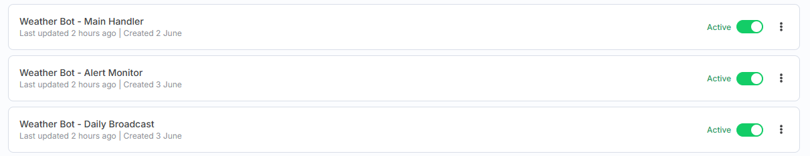
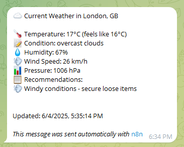
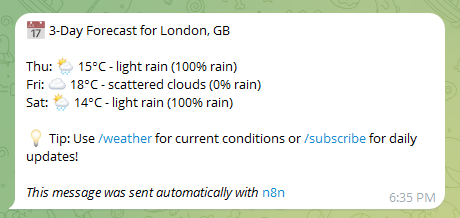
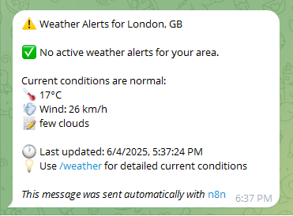
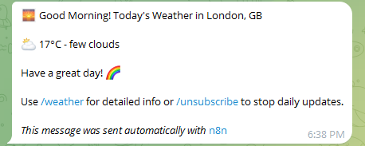

# 🌤️ Telegram Weather Alert Bot

A comprehensive weather bot for Telegram built with n8n that provides real-time weather updates, forecasts, severe weather alerts, and daily weather summaries.


## 🚀 Features

- **Real-time Weather Updates** - Current conditions with detailed information
- **3-Day Forecasts** - Plan ahead with accurate weather predictions
- **Severe Weather Alerts** - Automatic notifications for dangerous conditions
- **Daily Weather Summaries** - Morning weather updates delivered to subscribers
- **Smart Recommendations** - Contextual advice (umbrella, jacket, sunscreen)
- **Multi-location Support** - Track weather for multiple cities
- **User-friendly Commands** - Simple and intuitive bot interactions

## 🛠️ Tech Stack

- **n8n** - Workflow automation platform
- **Telegram Bot API** - Bot interface and messaging
- **OpenWeatherMap API** - Weather data source
- **Google Sheets** - User data and preferences storage

## 📱 Bot Commands

| Command | Description |
|---------|-------------|
| `/start` | Register and start using the bot |
| `/location [city]` | Set your location |
| `/weather` | Get current weather conditions |
| `/forecast` | Get 3-day weather forecast |
| `/subscribe` | Enable daily weather updates |
| `/unsubscribe` | Disable daily updates |
| `/alerts` | Check active weather warnings |
| `/help` | Show all available commands |

## 🏃‍♂️ Quick Start

1. **Prerequisites**
   - n8n instance (self-hosted or cloud)
   - Telegram Bot Token
   - OpenWeatherMap API Key
   - Google Sheets access

2. **Setup**
   ```bash
   git clone https://github.com/yourusername/telegram-weather-alert-bot.git
   cd telegram-weather-alert-bot
   ```

3. **Follow the detailed setup guide:** [📖 Setup Guide](docs/setup-guide.md)

## 📊 Workflow Overview

The bot consists of three main n8n workflows:

1. **Main Handler** - Processes user commands and interactions
2. **Daily Broadcast** - Sends morning weather summaries to subscribers
3. **Alert Monitor** - Monitors and sends severe weather alerts



## 🔧 Configuration

### Environment Variables

Create a `.env` file with the following variables:

```env
TELEGRAM_BOT_TOKEN=your_telegram_bot_token
OPENWEATHER_API_KEY=your_openweather_api_key
GOOGLE_SHEETS_ID=your_google_sheets_id
```

### Google Sheets Schema

| Column | Type | Description |
|--------|------|-------------|
| user_id | Number | Telegram user ID |
| username | String | Telegram username |
| location | String | User's city name |
| lat | Number | Latitude coordinate |
| lon | Number | Longitude coordinate |
| subscribed | Boolean | Daily updates subscription status |
| timezone | String | User's timezone |
| last_active | Date | Last interaction timestamp |

## 📈 Usage Statistics

- **Active Users**: Track with Google Sheets
- **API Calls**: Monitor OpenWeatherMap usage
- **Message Volume**: Telegram analytics

## 🤝 Contributing

We welcome contributions! Please see our [Contributing Guide](CONTRIBUTING.md) for details.

### Development Setup

1. Fork the repository
2. Create a feature branch: `git checkout -b feature/amazing-feature`
3. Commit changes: `git commit -m 'Add amazing feature'`
4. Push to branch: `git push origin feature/amazing-feature`
5. Open a Pull Request

## 📸 Screenshots

| Feature | Screenshot |
|---------|------------|
| Current Weather |  |
| 3-Day Forecast |  |
| Weather Alerts |  |
| Daily Summary |  |

## 🔒 Privacy & Security

- **No Personal Data Storage** - Only location and preferences
- **Secure API Handling** - All credentials properly encrypted
- **GDPR Compliant** - Users can delete their data anytime
- **Rate Limiting** - Prevents API abuse

## 📚 Documentation

- [📖 Complete Setup Guide](docs/setup-guide.md)
- [🔌 API Documentation](docs/api-documentation.md)
- [🏗️ Architecture Overview](docs/architecture.md)
- [🚀 Deployment Guide](docs/deployment.md)

## 🐛 Issues & Support

- **Bug Reports**: [GitHub Issues](https://github.com/yourusername/telegram-weather-alert-bot/issues)
- **Feature Requests**: [GitHub Discussions](https://github.com/yourusername/telegram-weather-alert-bot/discussions)
- **Support**: Create an issue with the `help` label

## 📄 License

This project is licensed under the MIT License - see the [LICENSE](LICENSE) file for details.

## 🙏 Acknowledgments

- [n8n](https://n8n.io/) - Workflow automation platform
- [OpenWeatherMap](https://openweathermap.org/) - Weather data provider
- [Telegram](https://telegram.org/) - Messaging platform

## 📊 Project Status


---

⭐ **Star this repository if you found it helpful!**

Built with ❤️ by [Your Name](https://github.com/yourusername)
